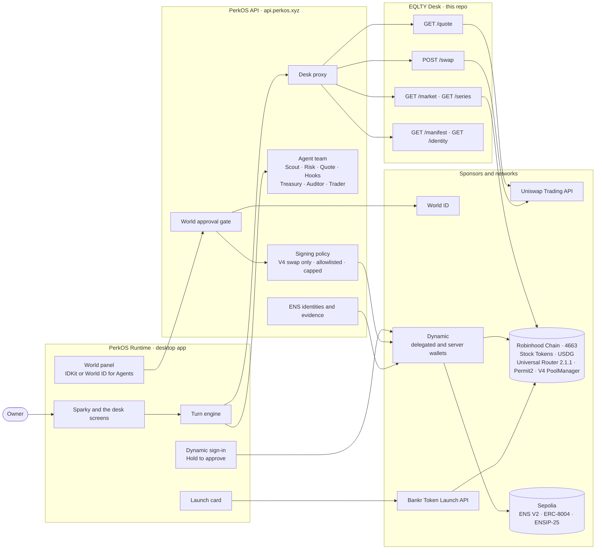
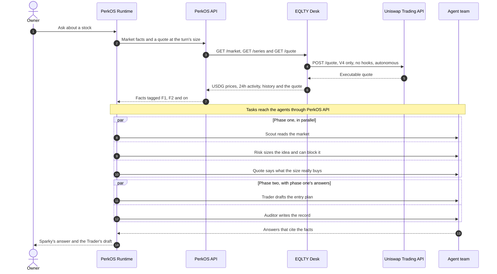
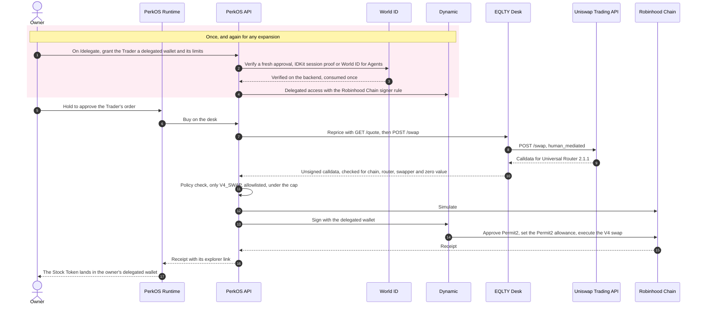
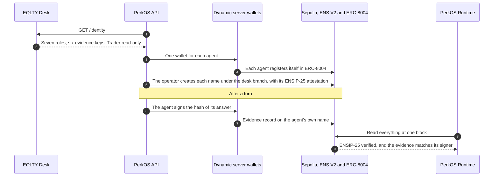
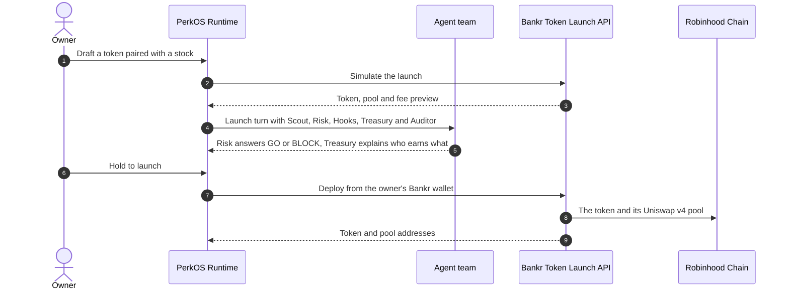

# EQLTY Desk

A Desk for [PerkOS Runtime](https://github.com/PerkOS-xyz/PerkOS-Runtime), on Robinhood Chain. It continues [PerkOS-EQLTY](https://github.com/PerkOS-xyz/PerkOS-EQLTY) and the craft of [PerkOS-Floor](https://github.com/PerkOS-xyz/PerkOS-Floor): the desk drafts, you approve, your wallet signs.

It holds no signing keys and signs nothing. Its one secret is the Uniswap Trading API key, read from the environment.

## Built at ETHGlobal Tokyo 2026

This repository was created during ETHGlobal Tokyo 2026: its first commit is from 25 Sep 2026, 22:47 JST, so its whole history is event work. The desk runs inside [PerkOS Runtime](https://github.com/PerkOS-xyz/PerkOS-Runtime), also created at the event, behind [PerkOS API](https://github.com/PerkOS-xyz/PerkOS-API), where the Tokyo work is PRs #281 to #299.

Live on 27 Sep 2026: the market, Uniswap quotes, the seven-agent team and its seven ENS identities. The buy and the token launch are built and gated: each one runs only after the owner holds to approve.

| Sponsor | What the desk does with it | Code | Evidence |
|---|---|---|---|
| **Uniswap** | Quote reads Uniswap's executable V4 price at the size of the turn, and every order is built as a V4 swap through Universal Router 2.1.1 with Permit2, with hooked pools left out. | Desk [`uniswap-client.ts` L33-L40](https://github.com/PerkOS-xyz/PerkOS-EQLTY-Desk/blob/d19287037efb833b3c47cfa3c97ee3dab42d76ce/src/uniswap-client.ts#L33-L40) (V4 only, `V4_NO_HOOKS`), [L260-L261](https://github.com/PerkOS-xyz/PerkOS-EQLTY-Desk/blob/d19287037efb833b3c47cfa3c97ee3dab42d76ce/src/uniswap-client.ts#L260-L261) (router 2.1.1, `x-agent-info`), [`quote.ts` L31](https://github.com/PerkOS-xyz/PerkOS-EQLTY-Desk/blob/d19287037efb833b3c47cfa3c97ee3dab42d76ce/src/quote.ts#L31) (`autonomous`), [`swap.ts` L30](https://github.com/PerkOS-xyz/PerkOS-EQLTY-Desk/blob/d19287037efb833b3c47cfa3c97ee3dab42d76ce/src/swap.ts#L30) (`human_mediated`) · Runtime [`uniswapFacts.ts`](https://github.com/PerkOS-xyz/PerkOS-Runtime/blob/752d1feb9b5d0332ea2026f5b09dfd7ab8289812/apps/web/app/lib/uniswapFacts.ts#L1-L61) · API [`robinhoodPolicy.ts` L65-L69](https://github.com/PerkOS-xyz/PerkOS-API/blob/081317c83deb5516680c5352be12b50c0075a5f7/src/services/wallet/robinhoodPolicy.ts#L65-L69) (only `V4_SWAP` is signed) | Quote request `6d22fedeaab35235a50282d756493806`, cited by the Quote agent and anchored on Sepolia in [tx 0x6d5f…2470](https://sepolia.etherscan.io/tx/0x6d5f728303fb9aeca19c987adcd5b9667ca020a06cf079da3f5ba1d31e192470) |
| **ENS** | Each of the seven agents holds an ENS V2 name on Sepolia with an ERC-8004 registration and an ENSIP-25 attestation. Six of them sign their own evidence; the Trader seat has an identity and no write grant. | Desk [`identity.ts` L8-L14](https://github.com/PerkOS-xyz/PerkOS-EQLTY-Desk/blob/d19287037efb833b3c47cfa3c97ee3dab42d76ce/src/identity.ts#L8-L14) · Runtime [`packages/ens`](https://github.com/PerkOS-xyz/PerkOS-Runtime/tree/752d1feb9b5d0332ea2026f5b09dfd7ab8289812/packages/ens) ([`reader.ts` L77](https://github.com/PerkOS-xyz/PerkOS-Runtime/blob/752d1feb9b5d0332ea2026f5b09dfd7ab8289812/packages/ens/src/reader.ts#L77), [`evidence.ts` L64](https://github.com/PerkOS-xyz/PerkOS-Runtime/blob/752d1feb9b5d0332ea2026f5b09dfd7ab8289812/packages/ens/src/evidence.ts#L64)) · API [`services/ens/service.ts` L72-L129](https://github.com/PerkOS-xyz/PerkOS-API/blob/081317c83deb5516680c5352be12b50c0075a5f7/src/services/ens/service.ts#L72-L129) | Team name `eqlty-96b280348018b5da.portfolio.perkosruntime.eth`, ERC-8004 IDs 10549 to 10555, Quote evidence in [tx 0x6d5f…2470](https://sepolia.etherscan.io/tx/0x6d5f728303fb9aeca19c987adcd5b9667ca020a06cf079da3f5ba1d31e192470) |
| **World** | Granting or expanding the Trader's delegated wallet needs a fresh approval from the same enrolled human, with IDKit (a Selfie Check session) or World ID for Agents, verified on the PerkOS backend. Reducing or revoking never needs a proof. | API [`worldGuard.ts` L40-L165](https://github.com/PerkOS-xyz/PerkOS-API/blob/081317c83deb5516680c5352be12b50c0075a5f7/src/services/delegation/worldGuard.ts#L40-L165), [`world/providers.ts` L41-L121](https://github.com/PerkOS-xyz/PerkOS-API/blob/081317c83deb5516680c5352be12b50c0075a5f7/src/services/world/providers.ts#L41-L121) · Runtime [`WorldPanel.tsx`](https://github.com/PerkOS-xyz/PerkOS-Runtime/blob/752d1feb9b5d0332ea2026f5b09dfd7ab8289812/apps/web/app/world/WorldPanel.tsx#L17-L150) | Without an approval the API answers `409 WORLD_APPROVAL_REQUIRED` ([`delegation.ts` L224](https://github.com/PerkOS-xyz/PerkOS-API/blob/081317c83deb5516680c5352be12b50c0075a5f7/src/routes/delegation.ts#L224)); runs on the World ID sandbox |
| **Dynamic** | The owner signs in with Dynamic, the Trader signs from a Dynamic delegated wallet under a Robinhood Chain signer rule, and each agent signs its ENS records from its own Dynamic server wallet. | Runtime [`DynamicWallet.tsx` L41-L54](https://github.com/PerkOS-xyz/PerkOS-Runtime/blob/752d1feb9b5d0332ea2026f5b09dfd7ab8289812/apps/web/app/wallet/DynamicWallet.tsx#L41-L54) · API [`robinhoodAllowlist.ts` L239-L247](https://github.com/PerkOS-xyz/PerkOS-API/blob/081317c83deb5516680c5352be12b50c0075a5f7/src/services/delegation/robinhoodAllowlist.ts#L239-L247), [`ens/signer.ts` L6-L10](https://github.com/PerkOS-xyz/PerkOS-API/blob/081317c83deb5516680c5352be12b50c0075a5f7/src/services/ens/signer.ts#L6-L10) | The signer rule is public at [`/delegation/config`](https://api.perkos.xyz/delegation/config); the Sepolia ENS transactions are signed by Dynamic server wallets |
| **Bankr** | The launch turn drafts a token paired with a stock on Robinhood Chain through the Bankr Token Launch API, with its own Uniswap v4 pool, simulated before the owner holds to launch. | Desk [`manifest.ts` L67-L78](https://github.com/PerkOS-xyz/PerkOS-EQLTY-Desk/blob/d19287037efb833b3c47cfa3c97ee3dab42d76ce/src/manifest.ts#L67-L78) (launch turn) · Runtime [`bankrLaunch.ts` L18-L24](https://github.com/PerkOS-xyz/PerkOS-Runtime/blob/752d1feb9b5d0332ea2026f5b09dfd7ab8289812/apps/web/app/lib/bankrLaunch.ts#L18-L24) | The launch goes out from the owner's own Bankr wallet; nobody on the desk launches it |
| **Robinhood Chain** | Every token the desk lists is a Robinhood Chain Stock Token priced in USDG, and every order spends USDG. | Desk [`config.ts` L16-L25](https://github.com/PerkOS-xyz/PerkOS-EQLTY-Desk/blob/d19287037efb833b3c47cfa3c97ee3dab42d76ce/src/config.ts#L16-L25), [`market.ts`](https://github.com/PerkOS-xyz/PerkOS-EQLTY-Desk/blob/d19287037efb833b3c47cfa3c97ee3dab42d76ce/src/market.ts) | The contracts below |

Our feedback to Uniswap from this build is in [FEEDBACK.md](FEEDBACK.md).

### Contracts on Robinhood Chain (chain 4663)

The desk deploys no contracts of its own. Its orders go through these, and the Dynamic signer rule allows only them and the Stock Tokens:

| Contract | Address |
|---|---|
| USDG | [`0x5fc5360D0400a0Fd4f2af552ADD042D716F1d168`](https://robinhoodchain.blockscout.com/address/0x5fc5360D0400a0Fd4f2af552ADD042D716F1d168) |
| Uniswap Universal Router 2.1.1 | [`0x8876789976decbfcbbbe364623c63652db8c0904`](https://robinhoodchain.blockscout.com/address/0x8876789976decbfcbbbe364623c63652db8c0904) |
| Permit2 | [`0x000000000022D473030F116dDEE9F6B43aC78BA3`](https://robinhoodchain.blockscout.com/address/0x000000000022D473030F116dDEE9F6B43aC78BA3) |
| Uniswap V4 PoolManager | [`0x8366a39CC670B4001A1121B8F6A443A643e40951`](https://robinhoodchain.blockscout.com/address/0x8366a39CC670B4001A1121B8F6A443A643e40951) |
| Robinhood stock token registry | [`0xe10b6f6B275de231345c20D14Ab812db62151b00`](https://robinhoodchain.blockscout.com/address/0xe10b6f6B275de231345c20D14Ab812db62151b00) |

## How it fits together



The desk is the market side of the team: it knows the tokens, prices them, asks Uniswap and builds the unsigned swap. Runtime runs the turn and shows it. PerkOS API hosts the agents, holds the rules that decide what may be signed, and asks Dynamic to sign. The desk itself holds no keys.

## A turn, step by step



## From a draft to a buy



## Agent identity and evidence on ENS



## Launching a token with Bankr



## What it answers

```
GET  /market                   what can be traded, priced
GET  /series?tickers=          price history for the facts a turn cites
GET  /health                   which contract version it speaks
GET  /manifest                 how the desk presents itself and how its team works a turn
GET  /quote?ticker=&amountIn=  what Uniswap gives for amountIn atomic USDG, read only
POST /swap                     the unsigned swap your wallet sends to buy
```

`/manifest` carries the desk's starters, each with the turn it runs (`analyze` or `advise`; none means Sparky answers alone), its screens, the rules and role prompts for each turn, the most one order may spend (`maxOrder`, in USDG) and the venues its orders route to.

`/quote` answers the same question with the same price for 20 seconds. `/swap` takes exactly `{ticker, amountIn, swapper, slippageBps}` and returns calldata for Universal Router 2.1.1 on Robinhood Chain, for the swapper's own wallet to send. When that wallet has not given Permit2 an allowance yet it answers 409 with the allowance to set on chain. Both cap an order at 100 USDG by default and answer 503 until `UNISWAP_API_KEY` is set. The variables are in `.env.example`.

## Team skills

The skills the desk's agents load live under `skills/`. Each one is self-contained in `skills/<name>/` (`SKILL.md`, `agents/`, `references/`, `scripts/`), so it can be fetched on its own at agent boot. They are not part of the service image.

- `quote-stock-token-route` reads the desk's executable Uniswap quote for a Stock Token buy through PerkOS, and reports the price, the route, the price impact and the protocols the quote considered.
- `design-fee-split` turns a fee-sharing intent for a token launch on Robinhood Chain into a Uniswap Liquidity Launchpad plan, and checks the launchpad contracts on chain.

They only read and compute. None of them signs, deploys or submits anything.

Their tests use Node's own test runner:

```
npm run test:skills
```

## Market activity

The catalogue prices every token but reports no 24h change or volume. The desk fills both from each token's deepest pool on Robinhood Chain (a public pair index, 30 tokens per request, cached two minutes). A slow or failed read leaves them `null` and never holds `/market` up. `DESK_ACTIVITY=off` turns it off; `DESK_ACTIVITY_URL` points it elsewhere.

## Development

Node 22.

```
npm install
npm run typecheck
npm test
npm start
```

## License

MIT.

## Public ENS identity descriptor

`GET /identity` declares all seven roles: Scout, Risk, Trader, Auditor, Hooks, Quote and Treasury. Six declare their public evidence key; Trader is read-only for ENS. The descriptor carries no addresses, signing keys or chain configuration. PerkOS-API matches it to the complete published/instantiated fleet and provisions identities; Runtime independently verifies Sepolia. Trading and the existing manifest remain compatible. Public-chain activation requires the corresponding Runtime/API release and configured parent/operator wallet.
